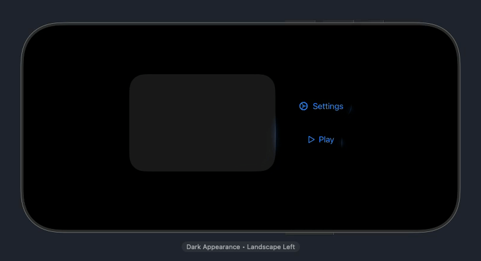

# GrowEffectKit

<p align="center">
  
</p>

SwiftUI package that provides an animated grow/glow effect backed by a bundled Metal shader.

## Preview



## Requirements

- iOS 18.0+
- macOS 15.0+
- Swift 6.0+

## Installation

Add the package with Swift Package Manager:

```text
https://github.com/didisouzacosta/GrowEffectKit.git
```

If you prefer SSH, use the repository remote:

```text
git@github.com:didisouzacosta/GrowEffectKit.git
```

In Xcode, choose **File > Add Package Dependencies...**, paste the repository URL, and add the `GrowEffectKit` library product to your app target.

During local DressMatch development, this package can still be linked from a local checkout. For shared or CI builds, prefer the GitHub package URL above.

## Usage

```swift
import GrowEffectKit
import SwiftUI

Button("Generate") {}
    .growEffect(
        isActive: true,
        peakScale: 1.025,
        duration: 1.45,
        glowOpacity: 0.28
    )
```

Use `GrowEffectConfiguration` when the caller needs to tune shader amplitude or frame interval:

```swift
let configuration = GrowEffectConfiguration(
    peakScale: 1.02,
    duration: 2.0,
    glowOpacity: 0.24,
    amplitude: 2.5,
    minimumTimelineInterval: 1.0 / 30.0
)

content.growEffect(isActive: isLoading, configuration: configuration)
```

## License

GrowEffectKit is available under the MIT license. See `LICENSE` for details.
